# 💾 useAutoSave Composable (`useAutoSave.js`)

[← Kembali ke Dokumentasi Utama](../../README.md)

Composable enterprise untuk penyimpanan formulir otomatis di latar belakang (*debounced & dirty-checked*) serta pemulihan draf saat pengguna membuka kembali halaman atau mengalami crash/koneksi putus.

---

## 🔄 Diagram Alur Kerja (Flowchart)

```mermaid
flowchart TD
    subgraph SG1 ["1. Sesi Mengetik - Auto-Save Lifecycle"]
        A["Pengguna Mengetik pada Input Form"] --> B["Debounce Timer Berjalan: 1500ms"]
        B --> C{"Apakah Data Berubah dari Snapshot?"}
        C -- "Tidak (Bersih)" --> D["Abaikan / Tetap Idle"]
        C -- "Ya (Kotor)" --> E["Ubah Status: saving"]
        E --> F["Simpan Payload & Timestamp ke Storage/API"]
        F --> G{"Penyimpanan Berhasil?"}
        G -- "Ya" --> H["Perbarui Snapshot & Status: saved"]
        G -- "Gagal" --> I["Ubah Status: error & Tombol Coba Lagi"]
    end

    subgraph SG2 ["2. Sesi Buka Ulang Halaman - Draft Recovery"]
        J["Halaman Form Dibuka Kembali"] --> K{"Ditemukan Draf Tersimpan di Storage?"}
        K -- "Tidak Ada / Kadaluwarsa" --> L["Gunakan Nilai Awal Form"]
        K -- "Ditemukan & Berbeda" --> M["Set hasDraft = true"]
        M --> N["Tampilkan Alert Banner Draf Ditemukan"]
        N --> O{"Tindakan Pengguna?"}
        O -- "Pulihkan Draf" --> P["Salin Data Draf ke Form Aktif"]
        O -- "Abaikan" --> Q["Hapus Draf dari Storage & Tutup Banner"]
    end

    subgraph SG3 ["3. Sesi Submit Sukses"]
        R["Pengguna Menekan Tombol Submit Resmi"] --> S["Panggil autoSave.purge()"]
        S --> T["Draf Lokal Dihapus Bersih dari Storage"]
    end
```



---

## 🌟 Fitur Utama

1. **Smart Dirty Diffing**:
   Hanya memicu penyimpanan jika nilai formulir benar-benar berubah dari snapshot penyimpanan terakhir (mencegah penulisan berulang dan spam request jaringan).
2. **Dual Storage Engine**:
   Mendukung penyimpanan lokal (`localStorage`) offline-first dan/atau pengiriman draf ke backend API (`remote` endpoint / custom callback).
3. **Debounced & Interval Modes**:
   Menyimpan otomatis setelah pengguna berhenti mengetik (default: 1500ms) atau berdasarkan interval berkala.
4. **Draft Expiration & Versioning**:
   Mencegah penumpukan data lama dengan batas kedaluwarsa otomatis (default: 7 hari).
5. **Inertia.js & Vue Form Compatibility**:
   Mendukung objek formulir standar Vue (`ref`, `reactive`) maupun Inertia `useForm` (otomatis memanggil `form.data()`).

---

## 📋 API Reference

### Konfigurasi Options `useAutoSave(formTarget, options)`

| Option | Tipe | Default | Deskripsi |
| :--- | :--- | :--- | :--- |
| `key` | `String` | **Wajib** | Kunci unik draf di penyimpanan (contoh: `'post_create'`, `'product_edit_42'`). |
| `debounceMs` | `Number` | `1500` | Jeda waktu mengetik sebelum draf disimpan otomatis (milidetik). |
| `intervalMs` | `Number` | `0` | Interval berkala simpan otomatis (0 = nonaktif). |
| `storage` | `String` | `'local'` | Pilihan target: `'local'`, `'remote'`, atau `'both'`. |
| `endpoint` | `String` | `''` | URL endpoint backend jika `storage` adalah `remote` atau `both`. |
| `saveHandler`| `Function` | `null` | Kustom async function `async (payload) => ...`. |
| `expiryDays` | `Number` | `7` | Masa aktif draf sebelum otomatis dihapus (hari). |
| `autoRestore`| `Boolean` | `false` | Otomatis pulihkan draf saat halaman dibuka tanpa konfirmasi. |
| `onSaved` | `Function` | `null` | Callback saat draf berhasil disimpan `(data, timestamp)`. |
| `onError` | `Function` | `null` | Callback saat terjadi galat simpan `(error)`. |

---

### Return Value

| Properti / Method | Tipe | Deskripsi |
| :--- | :--- | :--- |
| `status` | `Ref<String>` | Status saat ini: `'idle'`, `'saving'`, `'saved'`, `'error'`, `'paused'`. |
| `isDirty` | `Computed<Boolean>` | Bernilai `true` jika form saat ini memiliki perubahan yang belum tersimpan. |
| `lastSaved` | `Ref<Date\|null>` | Objek tanggal terakhir draf berhasil disimpan. |
| `lastSavedFormatted` | `Computed<String>` | Format waktu relatif (contoh: `"baru saja"`, `"2 menit yang lalu"`). |
| `hasDraft` | `Ref<Boolean>` | Bernilai `true` jika terdapat draf lama yang tersimpan di browser. |
| `draftTimeFormatted` | `Computed<String>` | Format waktu draf lama ditemukan. |
| `saveNow()` | `Function` | Memaksa proses simpan draf secara instan tanpa menunggu debounce. |
| `restoreDraft()` | `Function` | Menyalin isi data draf ke dalam formulir aktif. |
| `discardDraft()` | `Function` | Menghapus data draf dari penyimpanan lokal. |
| `purge()` | `Function` | Membersihkan draf sepenuhnya (panggil setelah formulir berhasil disubmit). |
| `pause()` / `resume()` | `Function` | Menjeda atau melanjutkan pemantauan auto-save. |

---

## 💡 Contoh Penggunaan

```javascript
import { ref } from 'vue';
import { useAutoSave } from '@/Composables/Pack/useAutoSave';
import AutoSaveStatus from '@/Components/Pack/AutoSaveStatus.vue';

const form = ref({
    title: '',
    content: '',
});

const autoSave = useAutoSave(form, {
    key: 'article_draft_1',
    debounceMs: 1500,
    onSaved: (data, time) => {
        console.log('Draf tersimpan:', time);
    },
});

// Panggil saat submit form berhasil:
const onSubmitSuccess = () => {
    autoSave.purge();
};
```
