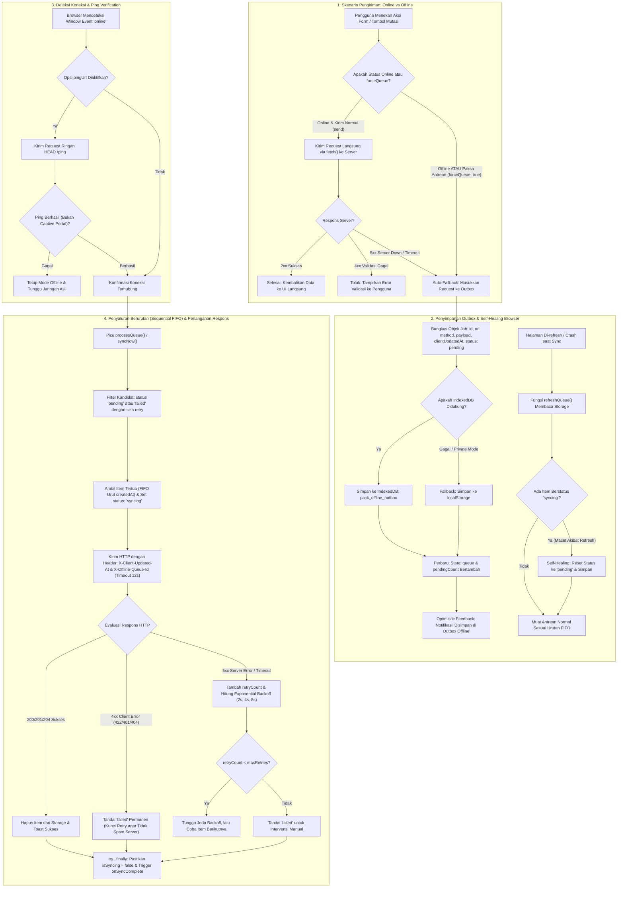

# 📶 useOfflineSync Composable (`useOfflineSync.js`)

[← Kembali ke Dokumentasi Utama](../../README.md)

Composable tingkat enterprise untuk mengelola **Client-Side Outbox Pattern** & antrean sinkronisasi data otomatis saat pengguna kehilangan koneksi internet.

> [!NOTE]
> **100% Ramah Shared Hosting (cPanel / LiteSpeed / Nginx)**:
> Seluruh antrean mutasi data dikelola secara lokal di dalam browser pengguna (`IndexedDB` dengan fallback otomatis ke `localStorage`). **Tidak memerlukan daemon background worker Laravel** (`php artisan queue:work`, Redis, atau Supervisor) yang umumnya dinonaktifkan oleh penyedia hosting murah. Server backend hanya menerima request HTTP POST/PUT/DELETE standar saat koneksi pulih.

---

## 🔄 Diagram Alur Lengkap (End-to-End Flowchart)



---

## 📖 Penjelasan Rinci Tiap Tahapan Alur

### 1. Skenario Pengiriman: Mode Online vs Mode Offline
* **Saat Mode Online (Kirim Normal)**:
  * Memanggil `offlineSync.send({ url, method, data })`.
  * Composable langsung melakukan `fetch()` ke server backend Laravel.
  * Jika server merespons **2xx (Sukses)**, data langsung diterima UI tanpa pernah masuk antrean outbox.
  * Jika terjadi **5xx (Server Error)** atau koneksi mendadak putus di tengah pengiriman, fungsi otomatis melakukan *fallback* dan memasukkan request tersebut ke antrean outbox agar dicoba ulang nanti.
* **Saat Mode Offline (Terputus)**:
  * Permintaan tidak dibuang dan tidak menyebabkan browser error.
  * Request langsung diubah menjadi objek pekerjaan (*Job Queue*) dan disimpan di browser.
* **Opsi Paksa Antrean (`forceQueue: true`)**:
  * Pengembang dapat memasukkan pekerjaan ke dalam antrean kapan pun untuk keperluan pengujian meskipun laptop sedang terhubung ke internet.

---

### 2. Penyimpanan Outbox & Mekanisme *Self-Healing* (Anti-Macet)
* **Penyimpanan Lokal**:
  * Menggunakan **IndexedDB** (`pack_offline_outbox`) yang memiliki kapasitas penyimpanan besar di browser.
  * Jika pengguna berada di mode penyamaran (*incognito*) atau browser memblokir IndexedDB, sistem otomatis beralih ke **localStorage**.
* **Proteksi *Self-Healing* saat Halaman Di-refresh**:
  * **Masalah yang Sering Terjadi**: Jika pengguna me-refresh halaman (`F5`) atau menutup tab tepat ketika sebuah item sedang berstatus `syncing`, item tersebut bisa tersimpan permanen sebagai `syncing` dan diabaikan pada reload berikutnya (menyebabkan spinner berputar selamanya).
  * **Solusi di Composable**: Setiap kali halaman dibuka atau fungsi `refreshQueue()` dipanggil, sistem mendeteksi item yang berstatus `syncing` dan **secara otomatis memulihkannya kembali menjadi `pending`**, sehingga antrean dapat langsung dilanjutkan tanpa macet.
* **Jaminan `try ... finally`**:
  * Siklus sinkronisasi dibungkus dalam blok `finally` untuk menjamin variabel reaktif `isSyncing.value = false` selalu terpanggil, memastikan tombol dan status UI tidak pernah terkunci.
* **Batas Waktu Request (*Timeout 12s*)**:
  * Setiap request HTTP ke server diproteksi dengan `AbortController` berbatas waktu 12 detik. Jika server lambat atau tidak merespons, request otomatis dibatalkan dan dijadwalkan ulang melalui mekanisme *retry*.

---

### 3. Deteksi Koneksi & Verifikasi Ping
* Composable mendengarkan event native browser `window.addEventListener('online')`.
* Jika opsi `pingUrl` diisi, sistem mengirimkan request ringan `HEAD` dengan parameter *cache-busting* (`?_t=timestamp`).
* Hal ini mencegah sinkronisasi palsu saat perangkat terhubung ke Wi-Fi publik yang masih tertahan di halaman login (*captive portal*).

---

### 4. Penyaluran Berurutan (*Sequential FIFO*) & Penanganan Status
* Antrean diproses satu per satu secara berurutan sesuai urutan waktu pembuatan (`createdAt`).
* Setiap request menyertakan header pelengkap:
  * `X-Client-Updated-At`: Waktu saat pengguna menekan tombol di browser.
  * `X-Offline-Queue-Id`: UUID unik untuk mencegah eksekusi ganda (*idempotency*).
* **Klasifikasi Status**:
  * **2xx (Sukses)**: Item dihapus dari IndexedDB dan antrean berkurang.
  * **4xx (Client Error / 422 Validasi Gagal / 401 Unauthorized)**: Item ditandai `failed` (badge merah) dan **tidak di-retry secara membabi buta** agar tidak membebani server dengan data yang memang salah. Pengguna dapat melihat pesan error dan memilih untuk mencoba ulang atau menghapusnya.
  * **5xx / Network Error**: Item di-retry secara otomatis dengan jeda waktu eksponensial (*Exponential Backoff*: 2 detik, 4 detik, 8 detik, maksimal 10 detik).

---

## 🛡️ Penanganan Tabrakan Data (*Data Conflicts & Race Conditions*)

Saat membangun aplikasi offline-first, terdapat 4 potensi konflik data dan cara penanganannya:

### 1. Urutan Aksi Saling Menimpa (*Out-of-Order Execution*)
* **Kasus**: Pengguna saat offline mengedit catatan ke versi A, lalu mengedit ke versi B, lalu menghapus catatan tersebut.
* **Penanganan**: **FIFO (First In, First Out)**. Antrean dikirim satu per satu secara berurutan dan menunggu konfirmasi sukses dari item sebelumnya sebelum mengeksekusi item berikutnya.

### 2. Tabrakan Antar-Pengguna / Multi-Device (*Concurrent Edit / Stale Overwrite*)
* **Kasus**: Pengguna A offline mengedit draf jam 09:40. Pengguna B di kantor sudah mengedit data yang sama di server jam 09:43. Saat Pengguna A online jam 09:45, perubahan Pengguna B berisiko tertimpa data usang.
* **Penanganan di Laravel**:
  Gunakan header `X-Client-Updated-At` yang dikirimkan oleh composable:
  ```php
  $clientTime = $request->header('X-Client-Updated-At');

  // Bandingkan dengan updated_at di database
  if ($post->updated_at && $clientTime && $post->updated_at->gt($clientTime)) {
      // Tolak penimpaan langsung dan kembalikan status 409 Conflict
      return response()->json([
          'message' => 'Data telah diperbarui oleh pengguna lain saat Anda offline.',
          'server_data' => $post,
      ], 409);
  }
  ```

### 3. Kegagalan Validasi Bisnis di Server (*Validation Collision*)
* **Kasus**: Pengguna saat offline memesan 5 barang. Saat online, stok barang di server ternyata sisa 2.
* **Penanganan**: Server merespons `422 Unprocessable Content`. Composable mendeteksi kode 4xx, langsung menghentikan retry otomatis untuk item tersebut, dan menandainya `failed` dengan detail pesan error server di antarmuka.

### 4. Eksekusi Ganda Akibat Koneksi Terputus (*Duplicate Execution / Idempotency*)
* **Kasus**: Server selesai memproses pesanan, namun koneksi internet putus tepat sebelum browser menerima respons `200`. Saat online, browser akan mengirim request yang sama lagi.
* **Penanganan di Laravel**:
  Gunakan header `X-Offline-Queue-Id`:
  ```php
  $queueId = $request->header('X-Offline-Queue-Id');

  if ($queueId && Cache::has("processed_job_{$queueId}")) {
      return response()->json(['message' => 'Transaksi telah diproses sebelumnya.'], 200);
  }

  // Jalankan transaksi...
  Cache::put("processed_job_{$queueId}", true, now()->addHours(24));
  ```

---

## 🧪 4 Skenario Pengujian (Test Cases) pada Demo Pratinjau

Di halaman pratinjau `Testing.vue` (`#section-offline-sync`), disediakan 4 skenario siap uji:

| Test Case | Endpoint | Metode | Perilaku yang Diuji |
|---|---|---|---|
| **1. Draf Blog (Sukses)** | `/api/posts/draft` | `POST` | Menguji pengiriman normal online (`200 OK`) dan pembersihan otomatis saat sinkronisasi offline. |
| **2. Update Keranjang (Sukses)** | `/api/cart/items/88` | `PUT` | Menguji pengiriman mutasi data dengan metode `PUT`. |
| **3. Uji Retry (Server Error)** | `/api/simulate-server-error` | `POST` | Server sengaja mengembalikan `500` untuk menguji *exponential backoff* dan counter retry (`1/3`, `2/3`, `3/3`). |
| **4. Uji Validasi (422 Failed)** | `/api/simulate-validation-error` | `POST` | Server mengembalikan `422` untuk memastikan item langsung ditandai `failed` (merah) tanpa spam server. |

---

## 📋 API Reference

### Konfigurasi Options `useOfflineSync(options)`

| Opsi | Tipe | Default | Keterangan |
|---|---|---|---|
| `dbName` | `string` | `'pack_offline_outbox'` | Nama database IndexedDB browser. |
| `storeName` | `string` | `'outbox_queue'` | Nama ObjectStore di dalam IndexedDB. |
| `autoSync` | `boolean` | `true` | Otomatis memproses antrean saat koneksi kembali online. |
| `maxRetries` | `number` | `3` | Batas maksimal percobaan pengiriman ulang untuk error server/5xx. |
| `baseRetryDelayMs`| `number` | `2000` | Waktu jeda dasar untuk exponential backoff retry (ms). |
| `pingUrl` | `string` | `''` | Endpoint ping untuk memverifikasi koneksi internet nyata. |
| `onItemSuccess` | `Function` | `null` | Hook callback saat item berhasil disinkronkan: `(item, response) => {}`. |
| `onItemFailed` | `Function` | `null` | Hook callback saat item gagal disinkronkan: `(item, error) => {}`. |
| `onSyncComplete` | `Function` | `null` | Hook callback saat seluruh siklus antrean tuntas: `({ total, succeeded, failed }) => {}`. |

### Return Values `useOfflineSync()`

| Properti / Method | Tipe | Keterangan |
|---|---|---|
| `queue` | `Ref<Array>` | Daftar reaktif seluruh item di dalam antrean Outbox. |
| `isOnline` | `ComputedRef<boolean>` | Status koneksi efektif (memperhitungkan mode simulasi). |
| `isSyncing` | `Ref<boolean>` | `true` jika dispatcher sedang memproses pengiriman antrean. |
| `isPaused` | `Ref<boolean>` | `true` jika dispatcher sedang dijeda secara manual. |
| `simulateOffline` | `Ref<boolean>` | Saklar untuk mensimulasikan kondisi offline di antarmuka pengembang. |
| `pendingCount` | `ComputedRef<number>` | Jumlah item yang berstatus `pending` atau menunggu giliran dikirim. |
| `failedCount` | `ComputedRef<number>` | Jumlah item yang berstatus `failed` setelah mencapai batas `maxRetries`. |
| `totalCount` | `ComputedRef<number>` | Total seluruh item yang ada di outbox. |
| `enqueue(job)` | `Function` | Menambahkan pekerjaan baru ke dalam antrean secara eksplisit. |
| `send(config)` | `Function` | Mengirim request; jika offline, otomatis disimpan ke outbox. Mendukung opsi `forceQueue: true`. |
| `syncNow()` | `Function` | Memicu eksekusi antrean sekarang juga secara manual. |
| `retryItem(id)` | `Function` | Mengatur ulang status item yang gagal ke `pending` dan mencoba lagi. |
| `removeItem(id)` | `Function` | Menghapus satu item dari antrean outbox. |
| `clearQueue()` | `Function` | Menghapus seluruh isi antrean outbox. |
| `pause()` / `resume()` | `Function` | Menjeda atau melanjutkan proses sinkronisasi otomatis. |
| `refreshQueue()` | `Function` | Membaca ulang storage dan menjalankan pemulihan mandiri (*self-healing*). |

---

## 💻 Contoh Penggunaan di Vue 3

```vue
<script setup>
import { ref } from 'vue';
import { useOfflineSync } from '@/Composables/Pack/useOfflineSync';
import { useNotification } from '@/Composables/Pack/useNotification';

const notify = useNotification();

const offlineSync = useOfflineSync({
    autoSync: true,
    onItemSuccess: (item) => {
        notify.success(`Sinkronisasi berhasil: ${item.title}`);
    },
    onSyncComplete: ({ succeeded, total }) => {
        if (succeeded > 0) {
            notify.info(`${succeeded} dari ${total} data offline berhasil disinkronkan ke server.`);
        }
    },
});

// Contoh Pengiriman Form dengan Fallback Otomatis
const handleSaveArticle = async () => {
    const result = await offlineSync.send({
        title: 'Draft Artikel: Panduan Payment Gateway',
        url: '/api/posts/draft',
        method: 'POST',
        data: {
            title: 'Panduan Payment Gateway',
            body: 'Konten artikel penting...',
            tags: ['laravel', 'fintech'],
        },
    });

    if (result.queued) {
        notify.warning('Anda sedang offline. Data disimpan di browser dan akan disinkronkan saat online.');
    } else if (result.success) {
        notify.success('Artikel berhasil disimpan ke server!');
    } else {
        notify.error(`Gagal menyimpan: ${result.error?.message}`);
    }
};
</script>

<template>
    <div class="space-y-4">
        <!-- Indikator Offline Outbox -->
        <div v-if="!offlineSync.isOnline.value" class="p-3 bg-amber-50 dark:bg-amber-950/40 text-amber-800 dark:text-amber-300 rounded-xl flex items-center justify-between text-xs">
            <span>Mode Offline: {{ offlineSync.pendingCount.value }} perubahan tersimpan lokal di browser.</span>
        </div>

        <button @click="handleSaveArticle" class="px-4 py-2 bg-primary-600 text-white rounded-xl text-xs font-bold">
            Simpan Artikel
        </button>
    </div>
</template>
```
