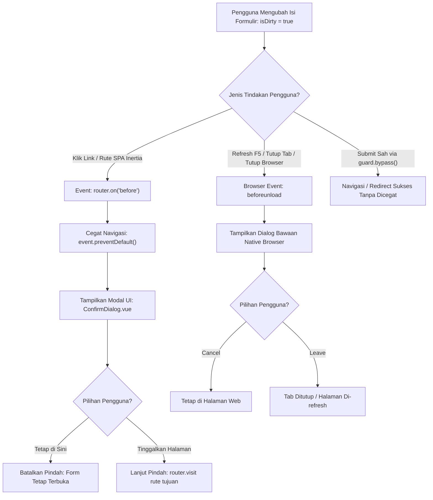

# 🛡️ useUnsavedChanges Composable (`useUnsavedChanges.js`)

[← Kembali ke Dokumentasi Utama](../../README.md)

Composable pelindung navigasi formulir (*Unsaved Changes Navigation Guard*) yang mencegah pengguna meninggalkan halaman secara tidak sengaja saat formulir masih memiliki perubahan yang belum disimpan (*isDirty*).

Mendukung perlindungan ganda:
1. **Browser Native (`beforeunload`)**: Mencegah penutupan tab, reload halaman (<kbd>F5</kbd>), atau pengetikan URL manual di address bar.
2. **Inertia.js SPA Router (`router.on('before')`)**: Mencegah navigasi internal SPA (klik link menu, tombol navigasi rute Inertia) dan menampilkan modal konfirmasi konfirmasi elegan [ConfirmDialog.vue](../components/confirm-dialog.md) berbasis `useConfirm.js`.

---

## 🔄 Diagram Alur Kerja (Flowchart)



---

## 🌟 Fitur Utama

1. **Dual Guard Engine**:
   Secara otomatis mengamankan navigasi native browser maupun transisi halaman internal Inertia SPA.
2. **Seamless ConfirmDialog Integration**:
   Alih-alih dialog `window.confirm` browser yang kaku, composable ini terhubung langsung ke `ConfirmDialog.vue` dengan animasi modern, ragam tema semantik, dan focus trap.
3. **Multi-Type Target Evaluator**:
   Menerima berbagai jenis target dirty:
   - `Ref<boolean>` sederhana.
   - Getter function `() => boolean`.
   - Inertia `useForm` object (membaca properti bawaan `form.isDirty`).
   - Composable `useAutoSave` (membaca `autoSave.isDirty`).
4. **Bypass Mechanism**:
   Menyediakan method `bypass()` yang memungkinkan formulir disubmit secara sah tanpa memicu peringatan pencegah navigasi.

---

## 📋 API Reference

### Konfigurasi Options `useUnsavedChanges(isDirtyTarget, options)`

| Option | Tipe | Default | Deskripsi |
| :--- | :--- | :--- | :--- |
| `isDirtyTarget` | `Ref\|Function\|Object` | **Wajib** | Penanda kondisi perubahan form (Ref boolean, `() => boolean`, atau objek `useForm`). |
| `title` | `String` | `'Perubahan Belum Disimpan'` | Judul modal dialog konfirmasi. |
| `message` | `String` | `'Ada perubahan pada formulir yang belum disimpan. Yakin ingin meninggalkan halaman ini?'` | Pesan peringatan konfirmasi. |
| `confirmText` | `String` | `'Tinggalkan Halaman'` | Teks label tombol konfirmasi keluar. |
| `cancelText` | `String` | `'Tetap di Sini'` | Teks label tombol batalkan keluar. |
| `variant` | `String` | `'warning'` | Tema warna modal konfirmasi (`'warning'`, `'danger'`, `'primary'`). |
| `useConfirmDialog`| `Boolean` | `true` | Menggunakan ConfirmDialog elegan (false = window.confirm browser). |
| `enabled` | `Boolean\|Ref<Boolean>` | `true` | Status toggle aktif/nonaktifnya pelindung. |
| `onLeave` | `Function` | `null` | Callback yang dipanggil jika pengguna memilih meninggalkan halaman. |
| `onStay` | `Function` | `null` | Callback yang dipanggil jika pengguna memilih tetap di halaman. |

---

### Return Value

| Properti / Method | Tipe | Deskripsi |
| :--- | :--- | :--- |
| `isGuarded` | `Computed<Boolean>` | Bernilai `true` jika form kotor dan pelindung sedang aktif menjaga halaman. |
| `isEnabled` | `Ref<Boolean>` | Status aktif/nonaktif perlindungan. |
| `isBypassing` | `Ref<Boolean>` | Status apakah pelindung sedang dilewati (*bypassed*). |
| `bypass()` | `Function` | Melewati perlindungan navigasi (panggil saat form disubmit). |
| `enable()` / `disable()` | `Function` | Mengaktifkan atau menonaktifkan pelindung secara dinamis. |
| `evaluateIsDirty()` | `Function` | Memeriksa nilai dirty terkini secara manual. |

---

## 💡 Contoh Penggunaan

### 1. Penggunaan dengan Form Biasa
```vue
<script setup>
import { ref, computed } from 'vue';
import { useUnsavedChanges } from '@/Composables/Pack/useUnsavedChanges';

const initialData = { name: 'Andi', bio: '' };
const form = ref({ ...initialData });

// Evaluasi apakah data berubah dari nilai awal
const isDirty = computed(() => JSON.stringify(form.value) !== JSON.stringify(initialData));

// Pasang pelindung navigasi
const guard = useUnsavedChanges(isDirty);

const handleSubmit = () => {
    // Lewati guard agar redirect setelah simpan tidak dicegat
    guard.bypass();
    console.log('Form disimpan');
};
</script>
```

### 2. Penggunaan dengan Inertia `useForm`
```javascript
import { useForm } from '@inertiajs/vue3';
import { useUnsavedChanges } from '@/Composables/Pack/useUnsavedChanges';

const form = useForm({
    title: '',
    content: '',
});

// useForm memiliki properti .isDirty bawaan
const guard = useUnsavedChanges(form);

const submit = () => {
    guard.bypass();
    form.post('/articles');
};
```
